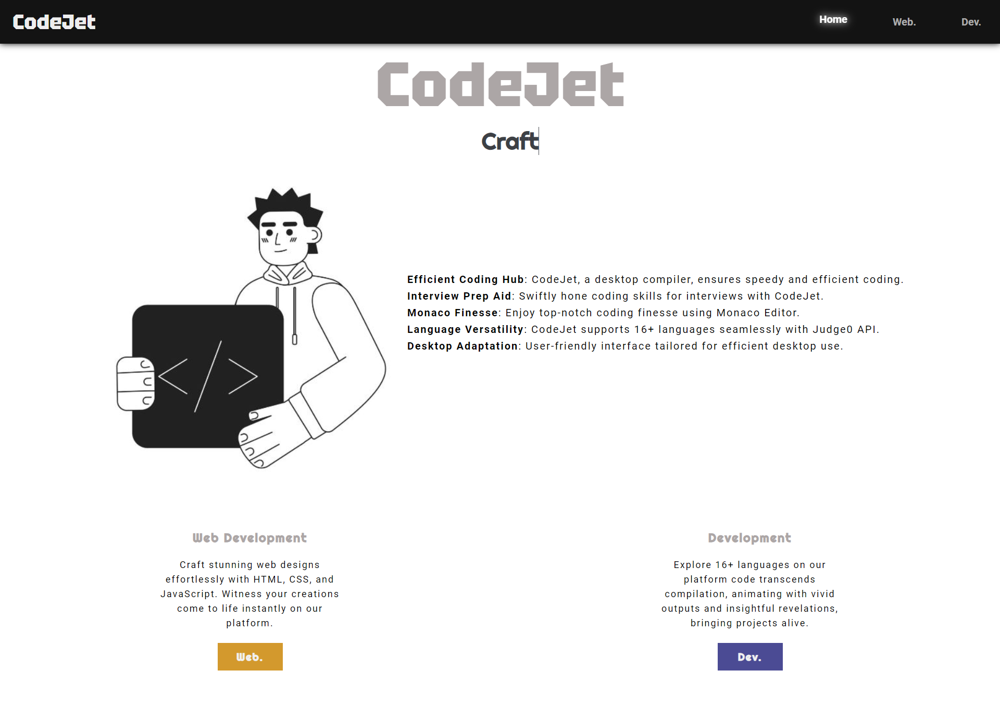

# CodeJet

- CodeJet is an desktop adaptive online compiler which can come handy to developers for some quick operation or tests as well as it can be quite helpful during any interview.
- It uses Monaco editor to power it up as an editor to give the best experience to the programmer while writing codes and it uses Judge0 api service to provide the compilation power to support more than 40 programming languages.

### Features and Functionalities

- It is a simple webapp that has two modes for developers
1. WEB-DEVELOPMENT
2. DEVELOPMENT

- You can choose any of them as per your requirements either from nav-bar or from home page.

- WEB-DEVELOPMENT mode enable user to write code in HTML, CSS and JavaScript to develop and develop any web designs.
- There are 3 text editors in top section which are collapsible and takes HTMl, CSS and JS a their input respectively.
- Whatever design user built should be displyed asynchronously in buttom section of the page.

- DEVELOPMENT mode allows the user to choose between 40+ languages and write code on that language over the editor provided.
- Output should be displayed on the output section in the right side of the page where as user can give custom input in the text box proveded and the status of your code with the details like memory and time should also bo visible just bellow the input box.

  

** The code you have written and the language choosen won't be erased or changed untill you change them.
